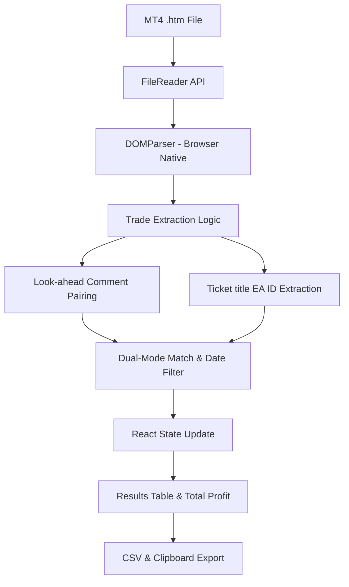

# System Design - MT4 EA Profit Filter

## Overview
MT4 EA Profit Filter is a high-performance, privacy-focused browser-based tool designed for traders to analyze MetaTrader account statements. It allows users to filter trades based on Expert Advisor (EA) comments using fuzzy matching logic and calculate exact profits within specific date ranges.

## Technology Stack
- **Framework**: [Next.js 14+](https://nextjs.org/) (App Router)
- **Language**: [TypeScript](https://www.typescriptlang.org/)
- **Styling**: [Tailwind CSS](https://tailwindcss.com/)
- **UI Components**: [shadcn/ui](https://ui.shadcn.com/)
- **Form Handling**: React Hook Form + Zod
- **Deployment**: Static Export (`output: "export"`)

## Architecture Decisions

### 1. Privacy-First Static Export
The application is designed as a fully client-side tool. By using Next.js static export, all processing occurs within the user's browser context.
- **Security**: Account statements (which contain sensitive financial data) are never uploaded to a server.
- **Speed**: Instant parsing and filtering without network latency for data processing.
- **Cost**: Zero infrastructure costs as the app can be hosted on simple CDNs like Cloudflare Pages or Vercel.

### 2. Domain-Specific Parsing
Unlike generic HTML parsers, this system uses a specialized algorithm to handle the non-standard, nested table structures produced by MetaTrader 4.

## System Data Flow

## Directory Structure
- `app/`: Contains the main layout and the home page.
- `components/`: UI components (FileUploader, FilterForm, ResultsTable).
- `lib/`: Core logic including the `parser.ts` and type definitions.
- `public/`: Static assets and icons.

## Strategy for MetaTrader 5 (MT5) Expansion
The system's architecture is prepared for MT5 support through:
- **Format Detection**: A middleware component to identify if a file is MT4 or MT5 based on column headers and metadata.
- **Modular Parsers**: Separation of the extraction logic into version-specific modules while sharing the same filtering and UI layers.
- **Standardized Schema**: Both parsers will output to the unified `Trade` interface defined in `lib/types.ts`.

## UI Component Patterns (Base UI Integration)

The project leverages **Base UI** as its primitive engine. This requires specific implementation details for shadcn/ui components:

### 1. The `asChild` Constraint
Unlike Radix UI, Base UI utilizes a **`render` prop** or **Function-as-Child** pattern for element composition.
- **Problem**: `asChild` is a core shandcn/ui convention but doesn't exist in Base UI.
- **Solution**: All UI triggers (Tooltip, Popover, Dialog, Dropdown) are wrapped in a component that intercepts `asChild` and translates it to a Base UI `render` prop.

### 2. Button Primitive Compatibility
- **Custom Button**: Our `Button` component supports `asChild` using `@radix-ui/react-slot` but defaults to Base UI's `ButtonPrimitive`.
- **Styling**: All variants use CVA merged with `tailwind-merge` (`cn` utility) for robust class management.

### 3. Ref Management
Always use `mergeProps` from `@base-ui/react/merge-props` when cloning children in a `render` prop to ensure both Base UI's internal logic and external `forwardRef` function correctly.
