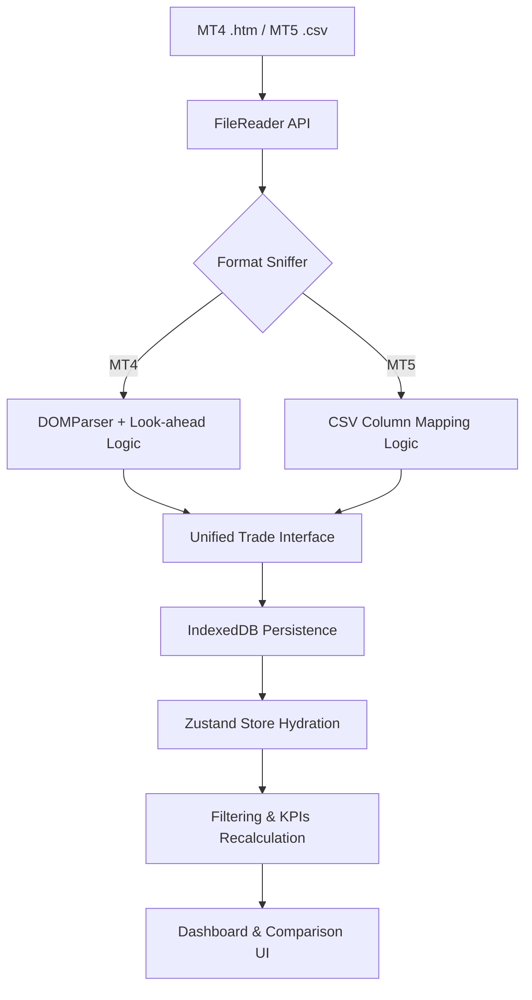

# System Design - MetaTrader Report Analyzer

## Overview
MetaTrader Report Analyzer is a high-performance, privacy-focused browser-based tool designed for traders to analyze MetaTrader account statements. It allows users to filter trades based on Expert Advisor (EA) identifiers using fuzzy matching logic and calculate exact profits within specific date ranges.

## Technology Stack
- **Framework**: [Next.js 16.2.4](https://nextjs.org/) (App Router)
- **Language**: [TypeScript](https://www.typescriptlang.org/)
- **Styling**: [Tailwind CSS 4](https://tailwindcss.com/)
- **State Management**: [Zustand 5.0](https://github.com/pmndrs/zustand) with `persist` middleware.
- **Database**: [Dexie.js 4.4](https://dexie.org/) (IndexedDB) for large trade datasets.
- **Visualization**: [Recharts 3.8](https://recharts.org/)
- **UI Primitives**: [Base UI 1.4](https://base-ui.com/) (formerly part of MUI)
- **Themes**: `next-themes` for reliable dark/light mode.
- **Deployment**: Static Export (`output: "export"`)

## Architecture Decisions

### 1. Privacy-First Static Export
The application is a fully client-side tool. By using Next.js static export, all processing occurs within the user's browser context.
- **Security**: Sensitive financial data is never uploaded to a server.
- **Cost**: Hosted on GitHub Pages with zero infrastructure cost.

### 2. Multi-Version Parsing Strategy
The system handles both MT4 (HTML) and MT5 (CSV) formats through a unified internal interface:
- **MT4 Parser**: DOM-based extraction for complex nested tables.
- **MT5 Parser**: High-speed string-based parsing for custom 21-column CSVs.
- **Adapter Pattern**: Versions-specific data is mapped to a common `Trade` interface in `lib/types.ts`.

### 3. Dynamic Currency Detection
Instead of hardcoding a single currency, the system detects the account currency from the report header.
- **Utility**: `lib/formatCurrency.ts` uses `Intl.NumberFormat` to support any currency code (USD, EUR, JPY, USC, etc.) with localized formatting.

## System Data Flow

## Sidebar & UI Primitive Implementation

### The `asChild` Constraint (Base UI)
Base UI uses a `render` prop pattern instead of Radix's `asChild`. 
- **Solution**: Components like `SidebarMenuButton` use a stable `render` function to manually clone children (like Next.js `Link`) and merge props (using `@base-ui/react/merge-props`). This ensures navigation and accessibility attributes are correctly passed down.

## Unified EA Comparison Architecture (P0-P5)

Consolidated all comparison features into a unified `EAComparator` that integrates directly into the main dashboard workspace.
- **Extended Metrics**: Calculates Profit Factor, Max Drawdown, Sharpe Ratio, Avg Profit, and Best/Worst trades.
- **Tabbed Visualization**:
    - **Equity Curve**: Shared time-axis performance tracking.
    - **Drawdown Chart**: Relative percentage sụt giảm tracking.
    - **Profit Distribution**: Histogram showing the count of trades by profit/loss range.
    - **Monthly Returns**: Heatmapped grid of periodic ROI.
- **Comparison Logic**: Supports "Within Report" (pattern matching) and "Across Reports" (comparing EAs from two different files).

## Global Hydration & Deep Linking

### Problem: Empty State on Deep Linking
Deep-linking to sub-routes (e.g., `/compare`) previously found an empty store because hydration was tied to the main page.

### Solution: Global Store Hydrator
- **`StoreHydrator.tsx`**: Mounted in `app/layout.tsx`, it blocks rendering (`Loading...`) until IndexedDB data is fully restored into the Zustand store. This guarantees that any route accessed has immediate access to active trading sessions.

## Persistent i18n Architecture

The application implements a decoupled internationalization strategy:
- **Settings Store**: `useSettingsStore` manages the `language` ('en' | 'vi') and persists to `localStorage`.
- **Decoupled Dictionary**: `lib/i18n.tsx` uses a nested structure for scalability.
- **Recursive Resolution**: The `t(path)` function resolves nested keys dynamically.
- **Static Compatibility**: No server-side components are used, maintaining compatibility with `next export`.
