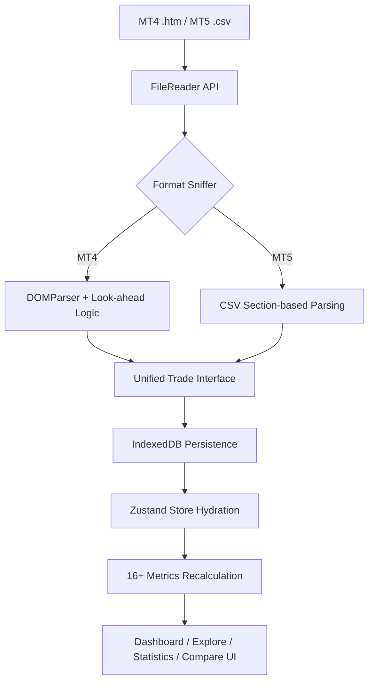

# System Design - MetaTrader Report Analyzer

## Overview
MetaTrader Report Analyzer is a high-performance, privacy-focused browser-based tool designed for traders to analyze MetaTrader account statements. It allows users to filter trades based on Expert Advisor (EA) identifiers using fuzzy matching logic and calculate 16+ deep performance metrics across multiple reports and sessions.

## Technology Stack
- **Framework**: [Next.js 16.2.4](https://nextjs.org/) (App Router)
- **Language**: [TypeScript](https://www.typescriptlang.org/)
- **Styling**: [Tailwind CSS 4](https://tailwindcss.com/)
- **State Management**: [Zustand 5.0](https://github.com/pmndrs/zustand) with `persist` middleware.
- **Database**: [Dexie.js 4.4](https://dexie.org/) (IndexedDB) for large trade datasets.
- **Visualization**: [Recharts 3.8](https://recharts.org/)
- **UI Primitives**: [Base UI 1.4](https://base-ui.com/) and [Shadcn UI](https://ui.shadcn.com/)
- **Themes**: `next-themes` for reliable dark/light mode synchronization.
- **Deployment**: Static Export (`output: "export"`)

## Architecture Decisions

### 1. Privacy-First Static Export
The application is a fully client-side tool. By using Next.js static export, all processing occurs within the user's browser context.
- **Security**: Sensitive financial data is never uploaded to a server.
- **Persistence**: Data is stored locally in IndexedDB, surviving page refreshes and browser restarts.

### 2. Multi-Version Parsing Strategy
The system handles both MT4 (HTML) and MT5 (CSV) formats through a unified internal interface:
- **MT4 Parser**: DOM-based extraction for complex nested tables, extracting EA IDs from ticket titles and paired comment rows.
- **MT5 Parser**: High-speed string-based parsing for custom 21-column CSVs containing Magic Numbers.
- **Unified Trade Interface**: Both parsers map data to a common `Trade` structure defined in `lib/types.ts`.

### 3. Comprehensive Performance Metrics (16+ KPIs)
The analysis engine calculates a wide range of institutional-grade metrics:
- **Core**: Net Profit, Win Rate, Profit Factor, Max Drawdown.
- **Risk/Reward**: Sharpe Ratio, Expectancy, Recovery Factor.
- **Averages**: Avg Profit/Trade, Avg Win, Avg Loss, Best/Worst Trades.
- **Distribution**: Long/Short rates, Profit per Day.

## System Data Flow

## Advanced Dashboards

### 1. Trade Explorer (/explore)
Provides visual deep-dives into a single trading session.
- **Hourly Analysis**: Identifies most/least profitable times of day.
- **DOW Analysis**: Breaks down performance by day of week.
- **Monthly Breakdown**: Shows long-term profitability trends.

### 2. Statistics Leaderboard (/statistics)
Aggregate view across all uploaded sessions.
- **EA Leaderboard**: Ranks strategies by total profit.
- **Global Equity Trend**: Cumulative growth across the entire portfolio.
- **Instrument Analysis**: Top traded symbols by volume and profit.

### 3. EA Comparator
Shared time-series visualization for benchmarking strategies.
- **Multi-Curve Equity**: Overlaid growth charts.
- **Relative Drawdown**: Visualizing risk overlap.
- **Distribution Histograms**: Trade outcome frequency analysis.

## i18n & Theme Management
- **Persistence**: Language and theme preferences are stored in `useSettingsStore`.
- **Theme-Aware Charts**: Chart elements (ticks, labels, tooltips) dynamically resolve colors based on `resolvedTheme` to ensure accessibility in both dark and light modes.
- **Localization**: Full EN/VI dictionary with recursive key resolution supporting nested namespaces.
