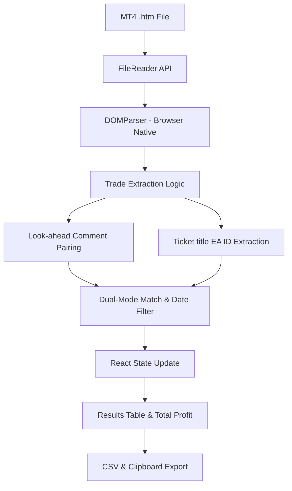

# System Design - MT4 EA Profit Filter

## Overview
MT4 EA Profit Filter is a high-performance, privacy-focused browser-based tool designed for traders to analyze MetaTrader account statements. It allows users to filter trades based on Expert Advisor (EA) comments using fuzzy matching logic and calculate exact profits within specific date ranges.

## Technology Stack
- **Framework**: [Next.js 14+](https://nextjs.org/) (App Router)
- **Language**: [TypeScript](https://www.typescriptlang.org/)
- **Styling**: [Tailwind CSS](https://tailwindcss.com/)
- **UI Components**: [shadcn/ui](https://ui.shadcn.com/)
- **Form Handling**: React Hook Form + Zod
- **Deployment**: Static Export (`output: "export"`)

## Architecture Decisions

### 1. Privacy-First Static Export
The application is designed as a fully client-side tool. By using Next.js static export, all processing occurs within the user's browser context.
- **Security**: Account statements (which contain sensitive financial data) are never uploaded to a server.
- **Speed**: Instant parsing and filtering without network latency for data processing.
- **Cost**: Zero infrastructure costs as the app can be hosted on simple CDNs like Cloudflare Pages or Vercel.

### 2. Domain-Specific Parsing
Unlike generic HTML parsers, this system uses a specialized algorithm to handle the non-standard, nested table structures produced by MetaTrader 4.

## System Data Flow

## Directory Structure
- `app/`: Contains the main layout and the home page.
- `components/`: UI components (FileUploader, FilterForm, ResultsTable).
- `lib/`: Core logic including the `parser.ts` and type definitions.
- `public/`: Static assets and icons.

## Strategy for MetaTrader 5 (MT5) Expansion
The system's architecture is prepared for MT5 support through:
- **Format Detection**: A middleware component to identify if a file is MT4 or MT5 based on column headers and metadata.
- **Modular Parsers**: Separation of the extraction logic into version-specific modules while sharing the same filtering and UI layers.
- **Standardized Schema**: Both parsers will output to the unified `Trade` interface defined in `lib/types.ts`.

## UI Component Patterns (Base UI Integration)

The project leverages **Base UI** as its primitive engine. This requires specific implementation details for shadcn/ui components:

### 1. The `asChild` Constraint
Unlike Radix UI, Base UI utilizes a **`render` prop** or **Function-as-Child** pattern for element composition.
- **Problem**: `asChild` is a core shandcn/ui convention but doesn't exist in Base UI.
- **Solution**: All UI triggers (Tooltip, Popover, Dialog, Dropdown) are wrapped in a component that intercepts `asChild` and translates it to a Base UI `render` prop.

### 2. Button Primitive Compatibility
- **Custom Button**: Our `Button` component supports `asChild` using `@radix-ui/react-slot` but defaults to Base UI's `ButtonPrimitive`.
- **Styling**: All variants use CVA merged with `tailwind-merge` (`cn` utility) for robust class management.

### 3. Ref Management
Always use `mergeProps` from `@base-ui/react/merge-props` when cloning children in a `render` prop to ensure both Base UI's internal logic and external `forwardRef` function correctly.

## Sidebar Implementation & Fixes

### Problem Summary
Sidebar menu items (text and icons) were invisible. Group labels had poor contrast. Navigation clicks did nothing (items were static placeholders with `href="#"`).

### Root Cause
The `SidebarMenuButton` component, built using **Base UI**, encountered a conflict between the `asChild` prop, the `useRender` hook, and the `TooltipTrigger`. Specifically:
- **State Conflict**: When `asChild` was `true`, the `children` were set to `undefined` in the component props to prevent duplicate rendering, but this caused the `Link` component (the child) to lose its content and styles during the cloning process.
- **Tooltip Wrapping**: Wrapping the `useRender` result in a `TooltipTrigger` after the fact interfered with Base UI's ability to correctly merge attributes and handle the component lifecycle.

### Solution
- **Refactored `SidebarMenuButton`**: Switched to a single, stable `render` function pattern. This function manually handles the cloning of `asChild` elements (like `Link`) and ensures all classes, active states, and event handlers are passed down in a single pass.
- **Integrated Tooltip**: Moved the `TooltipTrigger` *inside* the `useRender` lifecycle. This allows the trigger to participate in the prop-merging process, ensuring that navigation and accessibility attributes reach the final DOM element.
- **Visibility Optimization**:
  - Applied `opacity-100` and `font-semibold` to all menu text spans.
  - Enhanced group labels using `text-foreground/60` with bold uppercase styling for better hierarchy.
- **Standard Navigation**: Replaced placeholder links with Next.js `Link` components and used the `usePathname` hook to drive the `isActive` state for real-time visual feedback.

### Code References
- `components/ui/sidebar.tsx`: Refactored `SidebarMenuButton` rendering logic.
- `components/layout/AppSidebar.tsx`: Updated menu structure, navigation links, and group label styling.

### Verification
- Sidebar text and icons are clearly visible in both light and dark modes.
- Clicking "Dashboard" or test items performs correct routing.

## Unified EA Comparison Architecture

### Problem Summary
Previously, the application had two disjointed comparison systems: a "Multi-EA Analysis" textarea in the sidebar and a separate "EA Comparison" sheet overlay. This led to fragmented data pipelines, inconsistent matching logic, and a confusing user experience.

### Solution: The EA Comparator
Consolidated all comparison features into a single, unified `EAComparator` component that integrates directly into the main dashboard workspace.

- **True Route Navigation**: Instead of using internal view state overlays, the application uses distinct Next.js pages (e.g., `/compare`, `/history`) tied natively into the global layout shell, allowing robust browser navigation while maintaining workspace UI structures.
- **Integrated Tooling**:
    - **Within Report Mode**: Combines pattern-based filtering with a report selector. It leverages the session's active filters (threshold, mode, date range) for consistency.
    - **Across Reports Mode**: Allows side-by-side comparison of individual EAs from two different uploaded reports.
- **Refactored Data Visualization**:
    - **Shared Charting**: Optimized `ComparisonChart` (Recharts) to handle multi-series equity lines on a shared time axis, regardless of the comparison mode.
    - **Metrics Aggregation**: A unified table for comparing key performance indicators (Net Profit, Win Rate, Trade Count) across all selected series.

### Technical Implementation
- **Store Evolution**: Migrated from a singular global `comparisonResult` to component-local results for better encapsulation, while maintaining shared file data in the session store.
- **EA Auto-Discovery**: Implemented a system that extracts unique EA IDs from trade data to provide clickable "badges" for rapid configuration.
- **Reliability**: Unified the matching strategy across the app to ensure that a pattern entered in the dashboard yields the exact same results in the comparator.

## Next.js True Routing & Global Hydration
During the refactor to strict Next.js routing, a critical race condition was introduced where deep-linking to pages (like `/compare`) would find the global data store completely empty, as the IndexedDB load sequence was exclusively bound to the `page.tsx` (Dashboard) component.

### The Solution: Global Store Hydrator
Instead of tying IndexedDB parsing functions to individual UI components, the architecture now forces all data loading logic securely through a root-level intersection.

- **`StoreHydrator.tsx` Component**: Integrated natively inside `app/layout.tsx`. On mount, it kicks off `store.loadCachedStatement()` to pull stored metrics from IndexedDB prior to rendering internal tools.
- **Race Condition Prevention**: Added an `isHydrated` tracker variable onto the Zustand Store. The `StoreHydrator` purposefully blocks nested child rendering (`return <LoadingSpinner />`) up until hydration succeeds or concludes, comprehensively guaranteeing that route changes automatically process against active data pools regardless of deep linking combinations.
